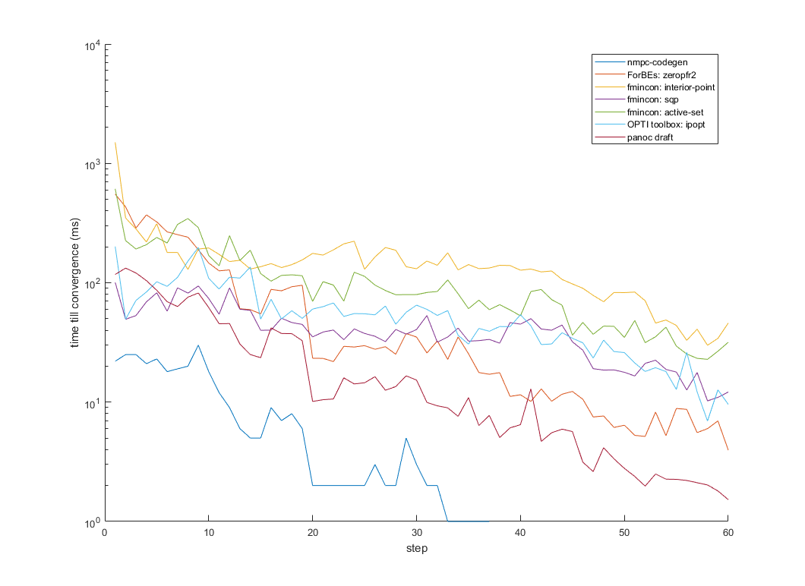

# PANOC NMPC solver

New: check out our [new site](https://kul-forbes.github.io/nmpc-codegen/) for more information(still under construction)

## What is this?
This project is still under construction but the goal is to generate an MPC controller. The user will provide the dynamics of the system, a number of conditions and some MPC parameters in python. The program will then generate an NMPC controller in c89 code that can be used on embedded devices.

Below you can find a comparison between the Matlab implementation (ForBes zerofpr2) fmincon(interior point method of matlab) and nmpc-codegen. The time represents the time till convergence in milliseconds of every step of the controller simulation.(source code: ./demos/Matlab/compare_libs.m).

The first version of Python is ready to be used, a Matlab version is on its way, right now its experimental.(run ./demos/thesis/TwoCircTrailer.py to get an idea what this is about)

More information in the  [user manual](tutorial.pdf) and the used [example script](tutorial_nmpc_codegen.py). A short introduction to the underlying algorithm can be found [here](PANOC.pdf)

## Notes
- The library is tested with casadi version 3.2, using other versions will lead to problems
- The tested compilers on the raw controller code are gcc GNU compiler, Clang LLVM compiler, Intel C compiler and the Microsoft C Compiler.
- cmake -H. -Bbuild -DCMAKE_C_COMPILER=clang creates a build system with clang compiler and Cmake