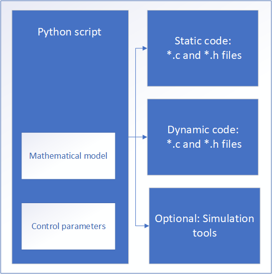
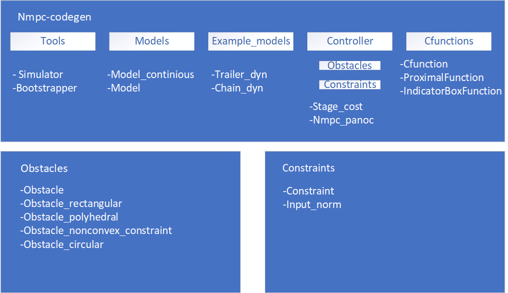

# About this library
This library was made by Willem Melis as part of the thesis for the Master mathematical engineering at KuLeuven. If you encounter problems installing or using the is library, feel free to make issue. Or contact Willem Melis directly using the new address and his github profile.

## Install instructions
[Install with Python3](./install/Python_install.md)

[Install with Matlab](./install/Matlab_install.md)

## Workflow
The Python or Matlab library provides a framework to construct a Python or Matlab script that generates a controller. The only thing the user has to provide are the control parameters and the mathematical model of the system. As these will differ for different controllers.

Additionally a few algorithm depending tuning parameters must also be provided. At the moment the only to joining parameters are the amount of iterations the algorithm is allowed to execute as long as algorithm does not converge. And an optional parameter that specifies if the cost function and the gradient should always be evaluated together or not.

## Internal structure Python/Matlab 
The structure of the Python or Matlab library is displayed below. There are five sub packages tools, models, example models, controller and Cfunctions. These are displayed in the drawing below. The two classes in the sub package models, represent the mathematical model of the system. The user must construct an object of one of these classes, that contains the function equation of the system.

The Cfunctions sub package contains proximal functions that represent constraints on the inputs. The user manual contains a table at all available constraints to the user. The tools sub package contains two classes. The bootstrapper can generate the static code, and the simulator that allows the user to call the generated C code from Python or Matlab.

The controller sub package contains the Nmpc_panoc class, an object of this class represents the actual controller. In order to construct an object of the Nmpc_panoc class user must provide a model object a proximal function object and one or two stage costs object.

Finally the user can also add obstacles, these will be added a soft constraints into the cost function. The obstacles can be found in the sub package obstacles from the sub package controller.

